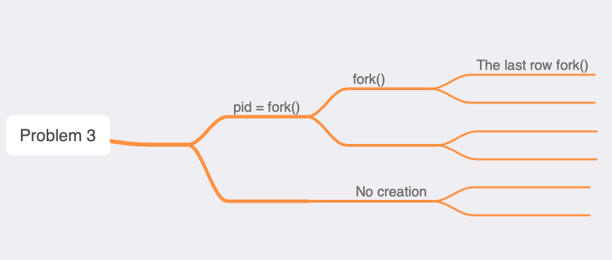
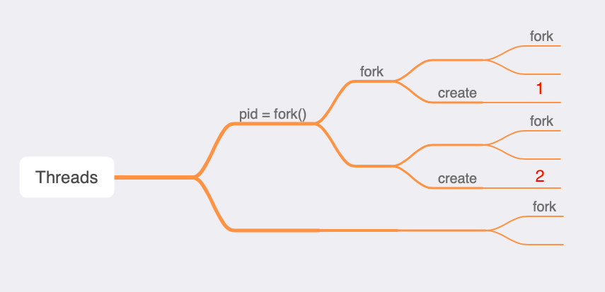

# OS homework week 6

### Problem 1

> Q :
>
> What are the two models of interprocess communication? What are the strengths and weaknesses of the two approaches?

> A :

1. Shared memory
   - Strengths :
     - Faster in passing informations
     - Save more time while visiting statistics, since using ordinary memory visit as a visiting method
     - Able to pass large amount of statistics
   - Weaknesses :
     - May cause **race condition**
2. Message passing
   - Strengths :
     - Easier to implement in distributed system
     - No problem of race condition
   - Weaknesses :
     - May use more time, since need the kernel to be in the job
     - Limited modularity (hard coding) [of direct communication]

### Problem 2

> Q :
>
> What are the benefits of multi-threading? Which of the following components of program state are shared across threads in a multithreaded process?
>
> ​		a. Register values
>
> ​		b. Heap memory
>
> ​		c. Global variables
>
> ​		d. Stack memory

> A :

- Benefits of multi-threading :
  1. Responsiveness and multi-tasking : Still can exist some threads respond when a thread is blocked
  2. Ease in data sharing
  3. Economy : Can save memory and resources than creating processes. Besides, context-switch between processes is also costly
  4. Scalability : Threads may be running in parallel on different cores
- b & c

### Problem 3

> Q :
>
> Consider the following code segment:
>
> ```c
> pid_t pid;
> pid = fork();
>
> if (pid == 0){	/* child process */
> 	fork();
> 	thread create( . . .);
> }
>
> fork();
> ```
>
> a. How many unique processes are created?
>
> b. How many unique threads are created?

> A :
>
> > a.

**6** unique processes are created :



> > b.

**2** unique threads are created :



> Note :
We assume that 'unique xxx created' refers to the ones created by `create()` function.  
Yet `fork()` numbers the original process.  
Remind that threads only execute the code section allocated in `pthread_create()` parameter

### Problem 4

> Q : The program shown in the following figure uses Pthreads. What would be the output from the program at LINE C and LINE P?

```c
#include <pthread.h>
#include <sys/wait.h>
#include <unistd.h>
#include <stdio.h>

int value = 0;
void *runner(void *param); // the thread

int main(int argc, char const *argv[])
{
	__darwin_pid_t pid;
	pthread_t tid;
	pthread_attr_t attr;

	pid = fork();

	if (pid == 0) // child process
	{
		pthread_attr_init(&attr);
		pthread_create(&tid, &attr, runner, NULL);
		pthread_join(tid, NULL);
		printf("CHILD: value = %d", value); // LINE C
	}
	else if (pid > 0) // parent process
	{
		wait(NULL);
		printf("PARENT: value = %d", value); // LINE P
	}

	return 0;
}

void *runner (void *param)
{
	value = 5;
	pthread_exit(0);
}
```

> A :

LINE C : CHILD: value = 5

LINE P : PARENT: value = 0

### Problem 5

> Q : What are the differences between ordinary pipe and named pipe?

> A :

|                       ordinary pipe                        |                          named pipe                          |
| :---------------------------------------------------------: | :----------------------------------------------------------: |
|                        Without name                         |                          With name                           |
| Used only for related processes (parent-child relationship) | No parent-child relationship is necessary (processes must reside on the same machine) |
|           Unidirectional (one-way communication)            |      Communication is bidirectional (still half-duplex)      |
|      Ceases to exist after communication has finished       |       Continue to exist until it is explicitly deleted       |
|   Allow communication in standard producer-consumer style    | Several processes can use the named pipe for communication (may have several writers) |

### Problem 6

> Q : What is race condition? Which property can guarantee that race condition will not happen?

> A :

- Race condition
  - Means the outcome of an execution depends on a particular order in which the shared resource is accessed.
- Property
  - Mutual exculsion

### Problem 7

> Q :
>
> The first known correct software solution to the critical-section problem for two processes was developed by Dekker. The two processes, P0 and P1, share the following variables:
>
> ```c
> boolean flag[2]; /* initially false */
>
> int turn;
> ```
>
> The structure of process `Pi (i == 0 or 1)` is shown in the following Figure; the other process is `Pj (j == 1 or 0)`. Prove that the algorithm satisfies all three requirements for the critical-section problem.

```c
do
{
	flag[i] = true;

	while (flag[j])
	{
		if (turn == j)
		{
			flag[i] = false;
			while (turn == j)
			{
				/* do nothing */
			};
			flag[i] = true;
		}
	}

		/* critical section */

	turn = j;
	flag[i] = false;

		/* remainder section */

} while (true);
```

> A :

1. **MutualExclusion**. *No two processes could be simultaneously inside their critical sections*

   As shown in the code above, when process [`j`] is under execution, process [`i`] will execute the `while (turn == j) { /* do nothing */ };` loop, so it won't actually be inside its critical section.

2. **Progress**. *No process running outside its critical section should block other processes*

   Take progress [`i`] as an example, if progress [`i`] is executing, it only changes its own parameter : `flag[i]` and global variable `turn`.

3. **Bounded waiting**. *No process would have to wait forever in order to enter its critical section*

   After process `i` or `j` has finished its execution of critical section, it will change its `flag` status into false, so that the other one is able to enter its critical section, therefore it won't end up waiting forever.

### Problem 8

> Q : Can strict alternation and Peterson’s solution sastify all the requirements as a solution of the critical-section problem? Please explain why

> A :

- The strict alternation does not satisfy the **Requirement #3**, which is '*No process running outside its critical section should block other processes.*'
  - The reason is that if process 1 is in turn but not executing, it cannot pass the turn to process 0, which is waiting in the principal of strict alternation.
- Peterson's solution have a hidden problem that violates the **Requirement #3**, which is '*No process running outside its critical section should block other processes.*'
  - The priority inversion problem is brought by the conflict that a high priority process owns the CPU resources, but cannot enter the critical region to execute, while a low priority process sits in the critical region not scheduled for a long time. In this case, both processes are blocked.

### Problem 9

> Q : What is semaphore? How to use semaphore to implement section entry and section exit (no busy waiting)? Please give the code

> A :

- Semaphore is a data type (additional shared object) that is accessed only through two standard **atomic** operations : `down()` (or 'P', or `wait()`) and `up()` (or 'V', or `signal()`)
- Code segment :

```c
// datatype definition
typedef int semaphore;
// section entry: down()
void down (semaphore *s)
{
	disable_interrupt();
	while (*s == 0)
	{
		enable_interrupt();
		special_sleep();
		disable_interrupt();
	}
	*s--;
	enable_interrupt();
}
// section exit: up()
void up(semaphore *s)
{
	disable_interrupt();
	if (!*s)
	{
		special_wakeup();
	}
	*s++;
	enable_interrupt();
}
```

### Problem 10

> Q : What is deadlock? List the four requirements of deadlock

> A :

两个或两个以上的线程在执行过程中，由于竞争资源或者由于彼此通信而造成的一种阻塞的现象，准确的说，集合中的每一个进程都在等待只能由本集合中的其他进程才能引发的事件，那么该组进程是死锁的。

- Deadlock is a phenomenon that two or more threads block each other when executing, due to a resource demand problem, that every thread in the group is waiting for a resource held by another thread, while holding some resources that others demand, forming one/several waiting circle(s).
- The 4 requirements :
  1. **Requirement #1: Mutual Exclusion**
  2. **Requirement #2: Hold and Wait**
  3. **Requirement #3: No preemption**
  4. **Requirement #4. Circular wait**
