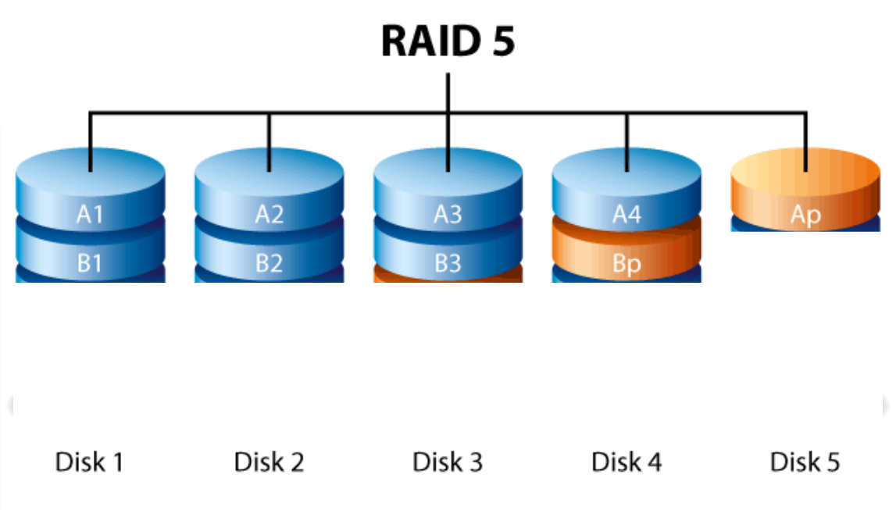
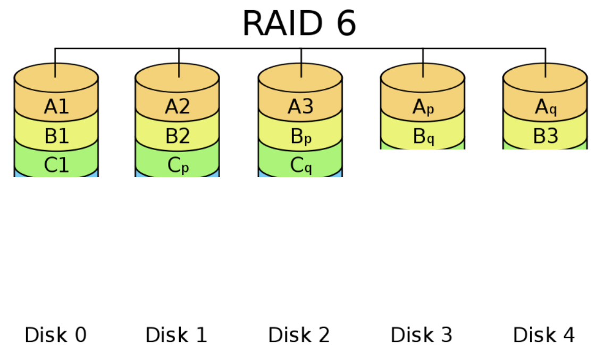

# OS homework 6

PB18000227 艾语晨

## Problem 1

> Q :
>
> Consider a RAID organization comprising five disks in total, how many blocks are accessed in order to perform the following operations for RAID-5 and RAID-6?
>
> a. An update of one block of data
>
> b. An update of seven continuous blocks of data. Assume that the seven contiguous blocks begin at a boundary of a stripe.

> A :

Read &Write are *both* access operations, RRW **do not** need to read parity block(s).

**a. An update of one block of data**

- RAID-5 : 4 blocks (The target block (R&W) and the parity block (R&W)) (RMW)
- RAID-6 : 6 blocks (The target block (R&W) and the parity blocks (R&W)) (RMW)

**b. An update of seven continuous blocks of data**

- RAID-5 : 10 blocks (Read B4 and write A1-A4, Ap, B1-B3, Bp) (RRW)
- RAID-6 : 16 blocks (Read Cp, Cq, C1and write A1-A3, Ap-Aq, B1-B3, Bp-Bq, C1, Cp-Cq) (Row 1,2: RRW; Row 3: RMW)

Data is stored in form of this: (I smeared unchanged blocks)

## Problem 2

> Q :
>
> Explain what open-file table is and why we need it

> A :

- OS keeps a table containing information about all open files (per- process and system-wide table). When a file is closed, its attributes in the table would be deleted.

- The reason is that we can save the time of searching the directory for locating the file (I/O operation).

## Problem 3

> Q :
>
> Explain the concept of file and directory, and what does “755” mean for file permission

> A :

- A *file* is a uniform logical view of stored information provided by OS.
	- **OS perspective**: A file is a logical storage unit (a sequence of logical records), it is an abstract data type
	- **User perspective**: the smallest allotment of logical secondary storage
- A *directory* is a file
	
- A directory file records all the files including directories that are belonging to it
	
- '755' equals to '111 101 101' in binary. So it means :

	| To whom         | Readable? | Writeable? | Executable? |
	| --------------- | --------- | ---------- | ----------- |
	| To owner        | True      | True       | True        |
	| To file's group | True      | False      | True        |
	| To others       | True      | False      | True        |

## Problem 4

> Q :
>
> Explain the problems of using continuous allocation for file system layout and how to solve them

> A :

- Problems

1. **External Fragmentation**
	- We have enough space, but there is no holes that I can satisfy the request
	- If we move files to fill those holes (defragmentation process), that would be a really expensive cost
2. **The Growth Problem**
	- If a file need to grow, we might have to move the files after it to have more space...

- Solutions 
	- Trial 2.0 : borrow idea from linked list, chop the storage device into equal-sized blocks

## Problem 5

> Q :
>
> What are the advantages of the variation of linked allocation that uses a FAT to chain together the blocks of a file? What is the major problem of FAT

> A :

- Advantages :
	- If the FAT is presented as **an array**, and a cached version of FAT is kept inside the kernel, the random access problem can be eased
	- The FAT is stored in memory, therefore it can be fast to search the FAT
	- A tradeoff can be made between (memory) space and performance by not storing the entire set of block locations in memory, so that not so much memory would be used
- Major problem :
	- The FAT eats too much memory to be stored

## Problem 6

> Q :
>
> Consider a file system similar to the one used by UNIX with indexed allocation, and assume that every file uses only one block. How many disk I/O operations might be required to read the contents of a small local file at /a/b/c in the following two cases? Should provide the detailed workflow.
>
> a. Assume that none of the disk blocks and inodes is currently being cached.
>
> b. Assume that none of the disk blocks is currently being cached but all inodes are in memory

> A :

**Not same as FAT, indexed allocation don't have to cache the index table in memory.** So every time (when not cached) we visit a file/directory, it would costs 2 I/O operations. However, the first step of the visit (such as the 'a' in this problem) will costs 3.

Thus, on 'a' condition, there are total $3+2+2=7$ times; on 'b' condition, there are total $2+1+1=4$ times

## Problem 7

> Q :
>
> Consider a file system that uses inodes to represent files. Disk blocks are 8-KB in size and a pointer to a disk block requires 4 bytes. This file system has 12 direct disk blocks, plus single, double, and triple indirect disk blocks. What is the maximum size of a file that can be stored in this file system

> A :

Referring to page 58 in ch9_Part2

1 block : 8 kB = $2^{13}$ Bytes; address length : 4 bytes

Total maximum size : $12\times2^{13}+2^{24}+2^{35}+2^{46}\approx7.04\times10^{13}$ bytes $\approx64$ TB

